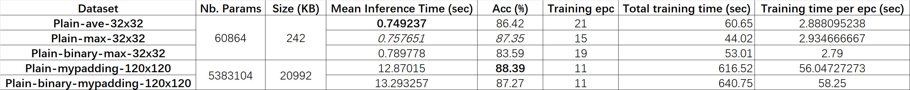

# Neural Network Optimization on Classification Task from Event Data

---
# Project Context and Objectives
- Determine Event Accumulation and Inference Limits:
  - This project investigates the balance between event accumulation and network inference time, aiming to identify the optimal trade-off for maintaining high prediction accuracy.
  - To achieve this, we constructed a series of lightweight models based on standard CNN frameworks.
- Quantisation Impact Assessment:
  - To maximise the reactivity offered by event cameras, we explore the use of quantised neural networks. 
  - This study centres exclusively on 8-bit quantisation to ensure lightweight and high-performance solutions.

---
# Project Structure

```plaintext
├── `config/`
│   └── `train/` 
│       └── `train_config.cfg` # Configuration file for training
│
├── `data/`
│   └── `ncars/`
│       └── `ave_32x32_DATASETS/`
│           └── `plain/`
│               ├── `train_n_cars_dataset_poolingave_1framepereventset_plain.pth`
│               ├── `valid_n_cars_dataset_poolingave_1framepereventset_plain.pth`
│               └── `test_n_cars_dataset_poolingave_1framepereventset_plain.pth`
│
├── `experiments/`         # Experiment results
│   ├── `exp001/`
│   │   ├── `checkpoint.pth`
│   │   ├── `log.txt`
│   │   ├── `confusion_matrix.png`
│   │   └── `learning_curves.png`
│   └── `exp00x/`
│
├── `models/`              # Architecture of the models
│   ├── `cnn_lenet.py`
│   ├── `cnn_lenet_q.py`
│   ├── `separable_convolution.py`
│   └── `separable_convolution_q.py`
│
├── `train/`               # Training scripts
│   ├── `test.py`
│   ├── `validate.py`
│   └── `train.py`
│
├── `utils/`
│   ├── `checkpoint.py`     # Save and load model checkpoints
│   ├── `datasets.py`       # Load datasets
│   ├── `device_info.py`    # Get device information
│   ├── `log.py`            # Generate and manage logs
│   ├── `metrics.py`        # Evaluation metrics
│   ├── `setup.py`          # Set up the training process
│   ├── `config_parser.py`  # Parse configuration files
│   ├── `visualisation.py`  # Visualise one frame / learning curves
│   └── `model_load_helper.py`  # Help to load models
│
├── `main.py`
│
├── `requirements.txt`
└── `README.md`
```

---
# TODO

[//]: # (- 完成quantization部分代码的移植)

[//]: # (- 完成生成和管理log的相关代码的实现 )

[//]: # (  - `log`应该主要负责记录**训练期间**的信息，就是`train_loss`,`training_time`等等)

[//]: # (  - 写在`utils`下面，然后存要存到`experiment/exp00?/train_log.txt`里)

[//]: # (  - 还要计算一个**训练**的 **总时长** 和 **一个epoch的平均时长**)

[//]: # (  - ~~最好能够生成一个类似表格的东东：~~)

[//]: # (  - （不需要size，mean inference time）)

[//]: # (  - 需要抬头有关“使用了哪个dataset”，“使用了哪个model”，“使用了哪个config”这样的信息，然后每一行是一个epoch的信息)

[//]: # ()
[//]: # (![img.png]&#40;img.png&#41;  )

[//]: # (  )
[//]: # ()
[//]: # (- 完成evaluation部分代码的移植，包括：)

[//]: # (  - 需要将结果记录在`experiment/exp00?/eval_log.txt`中)

[//]: # (  - inference time（**逐个**传入数据进行5次推断取平均）)

[//]: # (  - confusion matrix )

[//]: # (  - classification_report)

[//]: # (  )
[//]: # (- 完成evaluation结果的保存)

[//]: # (- 完成对于`train.train`中的`train_model_sheduled`函数的简洁化)

[//]: # (- 使用`Tensorboard`可视化训练过程？)

[//]: # (- 完成`Separable Conv-LeNet`的移植)

[//]: # (- 完成`Separable Conv-MobileNet`的移植)

- ✅ Complete the migration of the quantization code.
- ✅ Complete the implementation of code for generating and managing logs:  
  - The `log` should primarily record information during **training**, such as `train_loss`, `training_time`, etc.  
  - Write it under the `utils` directory, and store it in `experiment/exp00?/train_log.txt`.  
  - Calculate the **total training duration** and the **average duration per epoch**.  
  - ~~It would be nice to generate something resembling a table:~~  
  - (No need to include size or mean inference time).  
  - The header should contain information such as "which dataset was used," "which model was used," and "which config was used." Each row should represent information for one epoch.  

  

- ✅ Complete the migration of evaluation code, including:  
  - Log the results in `experiment/exp00?/eval_log.txt`.  
  - Record inference time (**pass the data individually** for five runs and take the average).  
  - Generate a confusion matrix.  
  - Generate a classification report.  

- ✅ Complete saving of evaluation results.  
- ✅ Simplify the `train_model_scheduled` function in `train.train`.  
- ❓ Use `TensorBoard` to visualise the training process?  
- ✅ Complete the migration of `Separable Conv-LeNet`.  
- ❓ Complete the migration of `Separable Conv-MobileNet`.